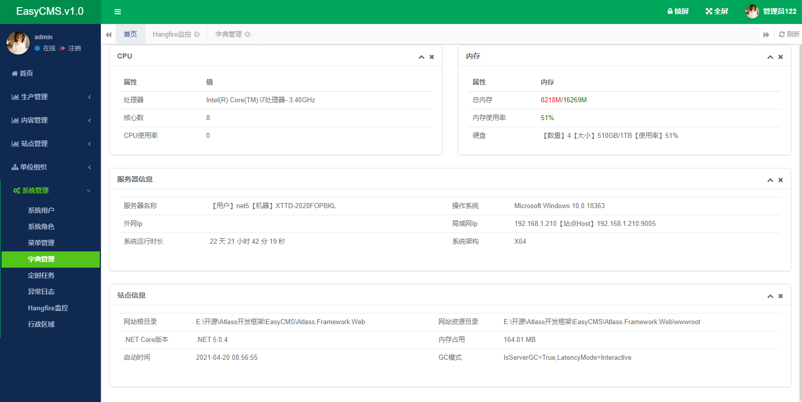
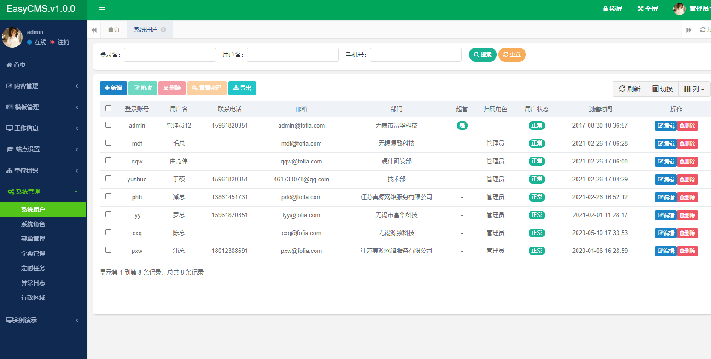
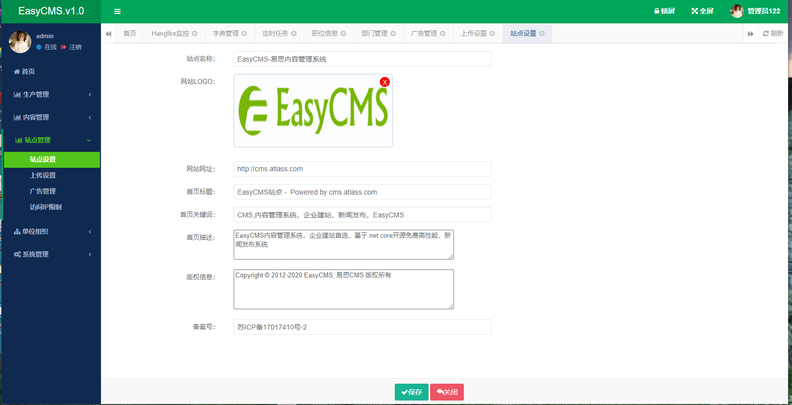
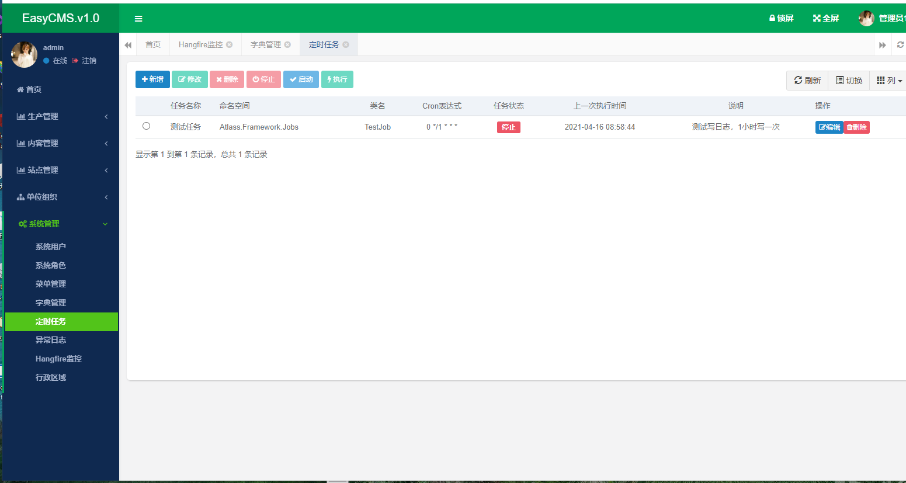

<!--
 * @Author: your name
 * @Date: 2020-12-28 17:31:14
 * @LastEditTime: 2021-04-22 17:03:09
 * @LastEditors: Please set LastEditors
 * @Description: In User Settings Edit
 * @FilePath: \undefinede:\开源\Atlass开发框架\EasyCMS\README.md
-->

# EasyCms
##  🛑禁止使用，禁止使用，禁止使用，正在升级net5.0,升级若依的UI和权限重构 
&emsp;&emsp;   
&emsp;&emsp;EasyCms后台管理系统 基于Asp.net Core的后台快速开发框架，可用于快速开发企业后台管理系统，企业站，微信公众号和小程序后台。    
&emsp;&emsp;同时我也写了个springboot版本的后台管理系统，暂时没有cms的功能，主要是为了学习springboot,功能基本一致
地址：https://gitee.com/xiaotuzi/easycmsboot
## 发展目标
             现实与理想的巨大差异皆源自于自身能力的不足，所以目标很简单
&emsp;&emsp;希望EasyCms成为一个简单易用的后台管理系统的基础开发框架和建站CMS系统。

 ## 目标客户为：
 **满足大部分企业建站需求使用的CMS管理系统**
## 技术介绍
+ 基于.net5
+ ORM使用[FreeSql](https://github.com/dotnetcore/FreeSql),默认使用mysql数据库
+ [Redis](https://github.com/tporadowski/redis)操作使用[freeredis](https://github.com/2881099/freeredis)
+ 缓存使用[EasyCaching](https://github.com/dotnetcore/EasyCaching)
+ 后台模板使用H+，扒的若依的UI
+ 静态页面生成模板引擎：[VTemplate.Engine](https://github.com/jasonyush/VTemplate.Engine)强大的模板引擎能够实现任何你想要的页面静态化
+ 定时任务采用[hangfire](https://github.com/HangfireIO/Hangfire)
## 演示地址：
 windows2016服务器：http://cms.atlass.cn/admin   
 debian10服务器：http://cmsl.atlass.cn/  暂时关了   
用户名和密码 admin  admin@123    
 🛑admin没做权限限制，请别删除数据

## 依赖环境
  [模板使用文档](https://www.yuque.com/jasonyush/easycms/dorh3a)
## 依赖环境
 .net5.0, redis,mysql,SqlServer,PostgreSql
## 功能列表（只列出CMS模块的）
+ [x] 栏目管理
+ [x] 文章管理
+ [x] 模板管理
+ [x] 模板匹配
+ [x] 静态页面生成（可以实现完全静态页面访问，也可以使用路由方式访问，没静态页面要求的，建议使用路由方式）
+ [X] 前台IP访问限制
+ [X] 站点信息设置
+ [X] 上传设置，水印设置
+ [X] 文章内容插入视频，大文件分片上传，播放器使用ckplayer
+ [x] 提供文章，栏目，站点信息的常用数据源，用于页面渲染调用
+ [x] 广告管理
+ [x] 通讯录
+ [x] 会议管理
+ [ ] 站点总访问量，在线人数统计
+ [ ] 栏目权限，文章数据权限
+ [ ] 意见反馈
+ [ ] 前台用户中心(这个功能感觉不是很必要，除非需要实现普通用户投稿)
## [样图]  

